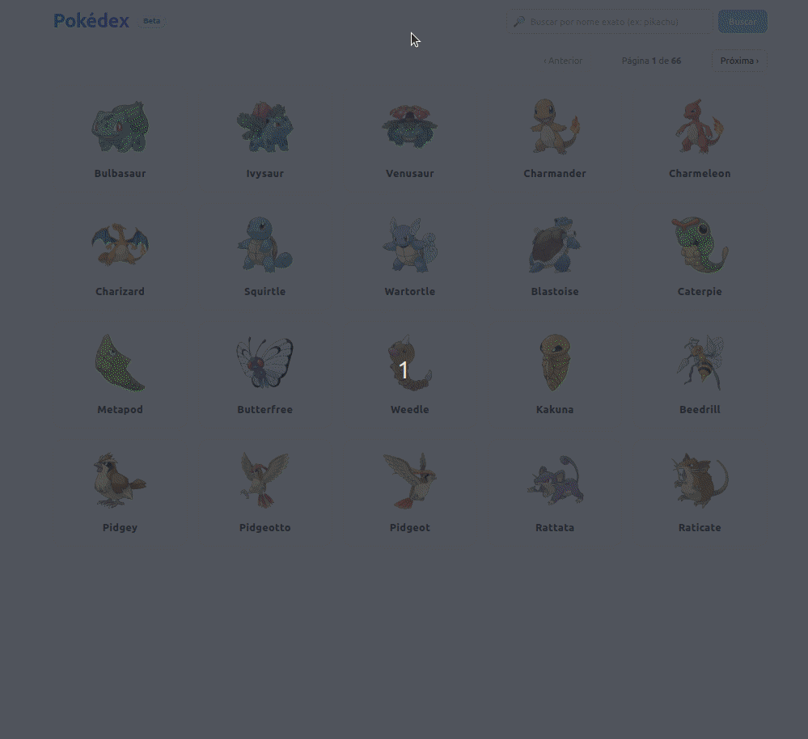

# Pokédex - Desafio Técnico

Aplicação desenvolvida como desafio técnico para avaliar conhecimentos em **Next.js**, **TypeScript** e integração entre front-end e back-end.  
O projeto consome a [PokeAPI](https://pokeapi.co/) e permite explorar Pokémons com listagem paginada, busca por nome/ID, e página de detalhes.  
Como diferencial, foi incluída uma funcionalidade de **IA mockada**, que gera curiosidades e frases divertidas sobre cada Pokémon.


---

## ✨ Funcionalidades

- **Listagem de Pokémons** com paginação
- **Busca** por nome ou ID
- **Página de detalhes** de cada Pokémon com:
  - Nome, imagem oficial e tipos
  - Status base (força, velocidade, etc.)
  - Habilidades
  - **IA mockada**: curiosidades e frases extras
- Estrutura pronta para melhorias visuais e estilização com **Tailwind** e **shadcn/ui**

---

## 🧱 Tecnologias Utilizadas

- **Front-end**: Next.js + TypeScript
- **Estilização**: TailwindCSS 
- **HTTP Client**: Axios
- **Back-end**: API Routes do Next.js (serverless), integrando com a PokeAPI
- **Linguagem**: TypeScript

---

## 🚀 Rodando o Projeto Localmente

### Pré-requisitos
- Node.js 18+
- npm ou yarn

### Passos
```bash
# Instalar dependências
npm install

# Rodar em modo dev
npm run dev

# Acessar no navegador
http://localhost:3000
```
--- 

## ⚙️ Estrutura de Pastas
/components
  card_skeleton.tsx   -> Componente de placeholder para loading
  pagination.tsx      -> Componente de paginação

/lib
  /ai                 -> Mock da IA (frases, curiosidades, dicas)
    battle_tips.ts
    fun_facts.ts
    quotes.ts
    index.ts          -> Builder que gera a "IA mockada" combinando quotes, facts e tips
  pokeapi.ts          -> Configuração do cliente HTTP para a PokeAPI
  formatters.ts       -> Utilitários para formatar altura (m) e peso (kg) a partir dos dados da PokeAPI

/pages
  /api/pokemon
    [name_or_id].ts   -> Endpoint para buscar detalhes de 1 Pokémon
    index.ts          -> Endpoint para listar Pokémons com paginação
  /pokemon
    [name].tsx        -> Página de detalhes do Pokémon
  index.tsx           -> Página inicial com listagem
  _app.tsx            -> Configuração base da aplicação

/public
  placeholder.png     -> Imagem fallback

/services
  pokemon.ts          -> Serviço de integração com endpoints internos

/styles
  globals.css         -> Estilos globais

/types
  pokemon.ts          -> Tipagens do domínio (Pokémon, stats, etc.)

---

## 🤖 IA Mockada

O desafio sugeria que a inclusão de uma funcionalidade de **IA** seria um diferencial.  
Como não foi utilizada nenhuma API de IA externa, foi implementado um **mock** no back-end (em `/lib/ai`).

Esse mock retorna dados adicionais para cada Pokémon:

- **ai_quote** → uma frase divertida como se fosse dita pelo próprio Pokémon  
- **ai_fun_fact** → uma curiosidade fictícia sobre o Pokémon  
- **battle_tips** → dicas genéricas de batalha relacionadas ao tipo do Pokémon  

Essas informações são exibidas junto aos detalhes de cada Pokémon, simulando um comportamento de IA e enriquecendo a experiência do usuário.

---
## 🚧 Melhorias Futuras
- Melhorias de UI/UX com shadcn/ui
- Tradução de tipos e habilidades para PT-BR
- Deploy em Vercel